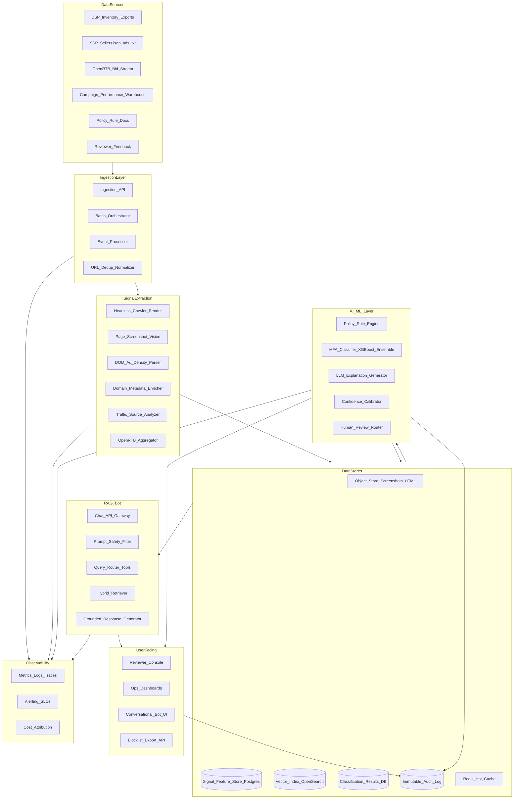
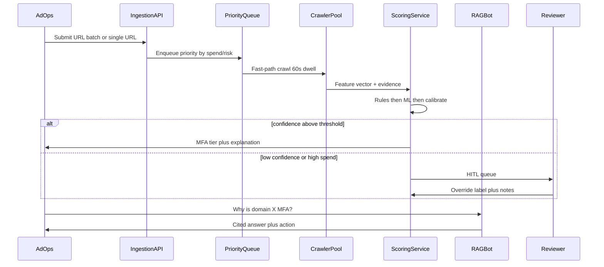
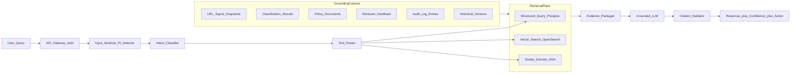
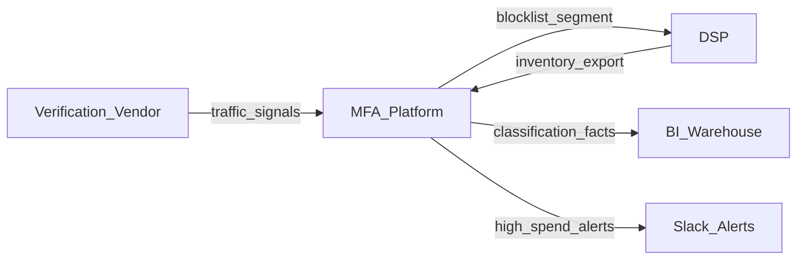

# MFA Detection Platform — Lead Architect Report

## Executive Summary

The platform is a **multi-signal, hybrid ML + LLM system** that ingests URLs from ad operations inventory, extracts page-level and domain-level evidence, scores MFA risk with calibrated confidence, explains decisions with cited signals, routes uncertain cases to human reviewers, and exposes a **RAG bot** grounded in structured signals + unstructured policy/evidence corpora.

Core design principle: **crawl + observed traffic + programmatic metadata** beat any single signal. MFA sites are engineered to pass surface checks (homepage looks fine; article pages are ad farms; direct vs referral traffic differs). The architecture therefore scores at **URL/page-section granularity**, not domain-only, and stores **versioned evidence snapshots** for audit and RAG grounding.

---

## 1. System Architecture



### Component Responsibilities

| Layer | Responsibility | Key outputs |
|-------|----------------|-------------|
| **Ingestion** | Accept batch CSV/API uploads + streaming new URLs from DSP/verification partners | Normalized `url_id`, crawl job, priority queue |
| **Crawler / Signal Extraction** | Render pages (referral vs direct personas), capture screenshots, measure ad density/refresh, extract content quality features | Structured feature vector + evidence artifacts |
| **Feature / Signal Store** | Versioned per-URL signal snapshots with lineage | `signals_v{n}`, SHAP contributions, raw metrics |
| **Scoring Service** | Rules + ML ensemble + tiered output (High/Medium/Low MFA risk) | `mfa_score`, `tier`, `confidence`, `top_signals` |
| **Explanation Layer** | Template + LLM narrative citing only retrieved signals | Human-readable explanation with citations |
| **Vector / Search Store** | Embeddings for policies, reviewer notes, similar domains, page text | Retrieved chunks with metadata filters |
| **RAG Bot** | Tool-augmented retrieval over signals DB + vector index + audit logs | Cited answers, confidence, recommended action |
| **Review UI** | Queue for low-confidence / high-spend URLs; override with reason | Reviewer labels → feedback loop |
| **Monitoring & Audit** | SLOs, drift detection, immutable decision trail | Compliance-ready audit records |

### Near-Real-Time vs Batch Path



- **Batch**: nightly inventory sweep (millions of URLs) via orchestrator (Step Functions / Airflow).
- **Near-real-time**: priority queue for new placements, pre-bid checks (&lt;2–5 min SLA) using cached domain signals + incremental crawl.

---

## 2. Data Signals — Research & Suitability

Signals grouped by **source**, **MFA relevance**, and **gaming risk**.

### Tier 1 — Highest value (combine for precision)

| Signal category | Examples | Why it matters | Source |
|-----------------|----------|----------------|--------|
| **Ad density & clutter** | Ad-to-content ratio &gt;30%, ads per viewport, sticky/video autoplay count | ANA/IAB core MFA criterion; directly measures arbitrage intent | Headless crawl + DOM analysis |
| **Ad refresh behavior** | Refresh count, `minint` interval, timer-triggered refreshes | MFA monetizes via impression recycling | Crawl dwell (60s+) + OpenRTB `Refresh` object |
| **Traffic source skew** | Paid traffic %, social/recommendation widget %, organic/direct % | Real publishers diversify; MFA depends on bought traffic | Log-level analytics, verification vendor feeds, Similarweb-style enrichment |
| **Referral vs direct persona delta** | Ad count, layout, content difference when arriving via Outbrain/Taboola vs direct | Classic MFA evasion tactic | Dual-persona crawl (referrer header simulation) |
| **Content quality** | Thin/duplicate/AI-generated text, clickbait headlines, author page absence | Editorial legitimacy proxy | NLP embeddings, simhash dedup, LLM-assisted quality rubric |

### Tier 2 — Strong supporting signals

| Signal | Examples | Notes |
|--------|----------|-------|
| **Domain metadata** | Domain age, WHOIS privacy, registrar churn, subdomain sprawl | Throwaway MFA ops pattern |
| **Authority / SEO** | Backlink count, Domain Rating, organic keyword footprint | Low authority + high impressions = suspect |
| **Page-level not domain-level** | Homepage vs article path scores (DV-style section scoring) | Avoid false positives on legitimate publishers |
| **Supply chain** | `sellers.json` node, `ads.txt` reseller chain, SSP MFA index | Block at seller level, not just domain |
| **Campaign performance anomalies** | High viewability + low conversion/attention vs peer set | MFA looks good on legacy KPIs |
| **OpenRTB impression metrics** | Viewability, CTR baselines per placement | Context for spend-weighted prioritization |

### Tier 3 — Contextual / policy / HITL

| Signal | Use |
|--------|-----|
| Reviewer overrides + notes | Gold labels for retraining; RAG corpus |
| Historical classification versions | "What changed since last review?" |
| Internal block/allow lists | Policy precedence |
| Industry reference lists (Jounce, etc.) | Bootstrap labels only — not sole truth |

### Signals to treat cautiously

- **Viewability alone** — MFA often scores *high* viewability (misleading).
- **IVT/fraud flags alone** — MFA traffic is often human and valid.
- **Homepage-only crawl** — easily gamed; always deep-link into articles.
- **Single-domain block** — subdomains and seller nodes matter.

### Recommended Feature Vector (MVP ~40–60 features)

Structured store in Postgres + parquet in data lake:

```
domain_age_days, ad_to_content_ratio, ads_above_fold, ad_slots_count,
refresh_events_60s, avg_refresh_interval_sec, paid_traffic_pct,
social_traffic_pct, organic_traffic_pct, referral_direct_delta_score,
content_word_count, content_uniqueness_score, author_page_exists,
slideshow_pagination_depth, video_autoplay_count, sticky_ad_count,
page_load_ad_latency_ms, sellers_json_risk_tier, historical_spend_usd,
campaign_ctr_vs_benchmark, simhash_dup_rate, llm_content_quality_score
```

---

## 3. Architecture Decision Records (ADR)

### ADR-001: Hybrid Rules + ML + LLM (not LLM-only classification)

- **Decision**: Deterministic rules catch known patterns; gradient-boosted ensemble (XGBoost/LightGBM) for ranking; LLM only for explanation and RAG — not primary classifier.
- **Rationale**: MFA classification needs **precision at scale** and auditability. LLM-only is costly, slower, and harder to calibrate. Industry vendors (IAS, DV, Pixalate) use multi-signal ML.
- **Trade-off**: More feature engineering upfront; lower hallucination risk.

### ADR-002: Page-section granularity with tiered output

- **Decision**: Output `MFA_High | MFA_Medium | MFA_Low | Non_MFA | Uncertain` per URL path pattern, not binary domain flag.
- **Rationale**: DV and ANA guidance emphasize shades of gray; homepage ≠ article experience.
- **Action mapping**: High → block; Medium → HITL; Low → monitor; Uncertain → HITL.

### ADR-003: Dual-persona headless crawling

- **Decision**: Playwright/Puppeteer cluster with (a) direct navigation and (b) simulated content-recommendation referrer; 60s dwell for refresh detection.
- **Build vs buy**: Build crawler core; optionally augment with commercial verification APIs (IAS/Pixalate) for traffic signals not observable via crawl.
- **Rationale**: Referral/direct delta is a top MFA tell per IAB/IAS.

### ADR-004: Vector store — OpenSearch k-NN (AWS primary)

- **Decision**: **OpenSearch Serverless** with hybrid BM25 + k-NN for RAG; metadata filters on `domain`, `url_id`, `signal_version`, `doc_type`.
- **Alternatives**: Pinecone (managed, fast POC), pgvector (simpler MVP, weaker scale), Azure AI Search, Vertex AI Vector Search.
- **Rationale**: Hybrid retrieval needed for exact domain lookups ("show me signals for X") and semantic ("sites similar to Y").

### ADR-005: LLM selection

| Use case | Model | Rationale |
|----------|-------|-----------|
| Explanation generation | GPT-4o-mini / Claude Haiku | Cost-effective, structured JSON output |
| RAG answers | GPT-4o / Claude Sonnet | Better grounding adherence |
| Content quality rubric | Small classifier + occasional LLM | Cost control |

- **Guardrail**: LLM receives **only** retrieved JSON evidence in context; no open web browsing in MVP.

### ADR-006: Orchestration — event-driven microservices

- **Decision**: API Gateway + Lambda/ECS for scoring; SQS priority queues; Step Functions for batch pipelines.
- **Rationale**: Decouples crawl latency from API; independent scaling of crawl workers vs scoring.

### ADR-007: Feature store — Postgres + S3 (not dedicated FEAST in MVP)

- **MVP**: Postgres JSONB for signals; S3 for artifacts.
- **Production**: Add Feast or DynamoDB for online serving if sub-100ms lookup required at bid time.

### ADR-008: Integration strategy

- **Inbound**: DSP export (CSV/S3), REST API, webhook for new domains, optional OpenRTB log sink (Kinesis).
- **Outbound**: Blocklist API, pre-bid segment push, BI dashboards (QuickSight/Looker), Slack alerts for high-spend MFA hits.
- **Buy**: Traffic enrichment (Similarweb), verification vendor MFA feed as **one signal**, not source of truth.

### ADR-009: Cloud primary — AWS

See Section 8 for full mapping. AWS chosen for mature ad-tech log processing (Kinesis/Glue), OpenSearch, and Step Functions batch orchestration.

---

## 4. RAG Bot Architecture



### RAG design details

**Corpus chunking strategy**

| `doc_type` | Content | Chunking | Metadata filters |
|------------|---------|----------|------------------|
| `signal_snapshot` | Structured metrics JSON | One doc per url_id+version | `domain`, `url`, `crawl_ts` |
| `explanation` | Generated narrative | Per classification event | `classification_id`, `tier` |
| `policy` | Internal MFA policy PDFs/wiki | 500-token overlapping chunks | `policy_version` |
| `reviewer_note` | Free-text override reason | Per review event | `reviewer_id`, `domain` |
| `audit` | Decision trail | Immutable event records | `entity_id`, `action` |

**Query routing (tool use)**

- "Why is X MFA?" → SQL fetch latest `classification` + `top_signals` + explanation; no vector needed.
- "Which signals contributed most?" → SHAP/feature attribution from signal store.
- "What changed since last review?" → Diff two `signal_snapshot` versions.
- "Show similar MFA websites" → Embedding of page content + k-NN with `tier IN (High, Medium)`.
- "What evidence supports Non-MFA?" → Fetch contradicting signals + reviewer overrides.

**Response contract (every answer)**

```json
{
  "answer": "...",
  "confidence": "high|medium|low|insufficient",
  "citations": [{"source": "signal_snapshot", "id": "...", "excerpt": "..."}],
  "top_signals": [{"name": "ad_to_content_ratio", "value": 0.42, "contribution": 0.31}],
  "recommended_action": "block|allow|recheck|human_review",
  "limitations": "..."
}
```

**Anti-hallucination pipeline**

1. Retrieve-first (no generation without evidence pack).
2. Citation validator: every claim must map to retrieved chunk ID.
3. If retrieval score &lt; threshold → respond "insufficient evidence" + escalate.
4. Conflicting signals → present both sides; default to `human_review`.

---

## 5. Risk & Guardrail Design

| Risk | Control |
|------|---------|
| **Hallucination** | Retrieval-only context; citation validator; structured output schema; ban free-form policy invention |
| **Prompt injection** | Input sanitizer; system prompt isolation; tool calls whitelisted; no instruction following from crawled page text stored as data |
| **False positives** | Tiered output; HITL for Medium/Uncertain; reviewer override; spend-weighted escalation; page-level not domain-only |
| **False negatives** | Monitor campaign underperformance clusters; periodic re-crawl; feedback loop from reviewers; drift alerts on feature distributions |
| **Data leakage** | Tenant isolation; RBAC; PII scrubbing in logs; no cross-advertiser signal sharing without consent; secrets in KMS |
| **Reviewer override** | Mandatory reason code; dual-control for bulk block; override does not delete ML score — stores `final_label` + `override_reason` |
| **Auditability** | Immutable audit log (S3 + DynamoDB); every score/explanation/RAG answer logged with `evidence_hash`; 7-year retention policy configurable |
| **Cost runaway** | Crawl budget per domain; LLM token caps; cache explanations 24h; batch off-peak |
| **Crawler abuse / legal** | Robots.txt respect (configurable); rate limits; user-agent identification; legal review for target markets |

---

## 6. MVP vs Production Roadmap

### POC (6–8 weeks) — prove signal lift

**In scope**

- 5K–10K URL sample with manual gold labels
- Single-persona crawler + ad density + content heuristics
- Rules-based scorer + simple XGBoost
- Template explanations (no LLM)
- Basic reviewer spreadsheet/UI
- Postgres only; no RAG bot

**Success criteria**: Precision ≥85%, Recall ≥70% on labeled set; explain top 5 signals.

### MVP (3–4 months after POC) — operational pilot

**In scope**

- Dual-persona crawler + 60s refresh detection
- Batch ingestion + API for single URL
- Tiered classification + confidence calibration
- LLM explanations with citations
- **RAG bot v1**: SQL + vector over signals, policies, classifications
- Reviewer console (queue, override, notes)
- QuickSight dashboard: MFA rate, spend at risk, reviewer throughput
- OpenSearch vector index; Redis cache
- Audit log v1

**Out of scope for MVP**

- Sub-second pre-bid integration
- Mobile app / CTV MFA
- Auto-retraining pipeline
- Multi-tenant SaaS hardening

### Production (6–9 months total) — scale & harden

**In scope**

- Near-real-time path (&lt;5 min) with priority queue
- Pre-bid API for DSP/verification integration
- Auto-retraining monthly with reviewer gold labels
- RAG bot v2: similar-domain search, change detection, reviewer feedback corpus
- Model drift monitoring, A/B shadow mode for model updates
- SSO (Okta), full RBAC, SOC2-aligned controls
- Multi-region DR, rate limiting, WAF
- Cost attribution per team/campaign

### Future enhancements (intentionally deferred)

- Federated learning across advertisers
- On-device / edge scoring
- Generative synthetic MFA for training augmentation
- Automated SSP seller-node blocking workflows
- CTV/mobile app MFA (separate feature pipelines per Pixalate/IAS)

---

## 7. Estimation

### Team (core build)

| Role | FTE | Duration |
|------|-----|----------|
| Lead / Solution Architect | 0.5 | POC→Prod |
| Backend / Platform Engineer | 2 | POC→Prod |
| ML Engineer | 1 | POC→Prod |
| Data Engineer | 1 | MVP→Prod |
| Frontend (Review UI + Bot) | 1 | MVP→Prod |
| DevOps / SRE | 0.5 | MVP→Prod |
| Ad Ops SME / QA | 0.5 | POC→Prod |
| Product Manager | 0.5 | All phases |

**Total core effort**: ~7–8 FTE peak during MVP.

### Timeline

| Phase | Duration | Cumulative |
|-------|----------|------------|
| POC | 6–8 weeks | 2 months |
| MVP pilot | 10–12 weeks | 5 months |
| Production hardening | 12–16 weeks | 8–9 months |

### Infrastructure / API cost (monthly, production pilot scale)

Assumptions: 500K URLs/month crawled, 50K RAG queries/month, 20K daily active classifications cached.

| Item | AWS range USD/mo |
|------|------------------|
| ECS Fargate crawler pool (10–30 workers) | $3K–$8K |
| OpenSearch Serverless | $1.5K–$4K |
| RDS Postgres + ElastiCache | $800–$2K |
| S3 artifacts + CloudFront | $300–$1K |
| Lambda / API Gateway | $200–$800 |
| LLM APIs (explanations + RAG) | $2K–$6K |
| Observability (CloudWatch, X-Ray) | $500–$1.5K |
| **Total** | **~$8K–$23K/mo** |

At 5M URLs/month scale: **$40K–$90K/mo** (crawler-dominated).

### Key dependencies

- Labeled MFA dataset (internal review + optional vendor lists)
- DSP/inventory data feed access
- Legal approval for crawling targets
- Ad Ops adoption of reviewer workflow
- Optional: verification vendor API for traffic signals

### Rollout assumptions

- Pilot with 1–2 advertiser accounts before global rollout
- Shadow mode for 4 weeks before enforcing blocks
- Reviewer SLA: 24h for high-spend uncertain URLs

---

## 8. Cloud Service Mapping & Scale Plan

### AWS (recommended primary)

| Capability | AWS Service |
|------------|-------------|
| API / auth | API Gateway + Cognito/Okta |
| Batch orchestration | Step Functions + EventBridge |
| Stream ingestion | Kinesis Data Streams → Lambda |
| Crawler workers | ECS Fargate + SQS priority queues |
| Object storage | S3 (screenshots, HTML, parquet) |
| Signal / classification DB | RDS PostgreSQL |
| Hot cache | ElastiCache Redis |
| Vector / hybrid search | OpenSearch Serverless |
| LLM | Bedrock (Claude) or Azure OpenAI via private link |
| Dashboards | QuickSight |
| Audit | DynamoDB + S3 Object Lock |
| Secrets | Secrets Manager + KMS |
| WAF / DDoS | AWS WAF + Shield |

### Azure equivalents

| Capability | Azure Service |
|------------|---------------|
| API / auth | API Management + Entra ID |
| Batch | Data Factory + Logic Apps |
| Stream | Event Hubs |
| Crawler | Container Apps / AKS |
| Storage | Blob Storage |
| DB | Azure Database for PostgreSQL |
| Cache | Azure Cache for Redis |
| Vector search | Azure AI Search |
| LLM | Azure OpenAI Service |
| Dashboards | Power BI |
| Audit | Cosmos DB + Immutable Blob |

### GCP equivalents

| Capability | GCP Service |
|------------|-------------|
| API / auth | Cloud Endpoints + Identity Platform |
| Batch | Cloud Composer (Airflow) |
| Stream | Pub/Sub + Dataflow |
| Crawler | Cloud Run / GKE |
| Storage | Cloud Storage |
| DB | Cloud SQL PostgreSQL |
| Cache | Memorystore Redis |
| Vector search | Vertex AI Vector Search |
| LLM | Vertex AI (Gemini) |
| Dashboards | Looker |
| Audit | BigQuery + Cloud Logging |

### Scale plan

| Scale tier | URLs/month | Architecture adjustment |
|------------|------------|----------------------|
| **Pilot** | 50K–500K | Single-region; 5–10 crawlers; batch nightly |
| **Growth** | 500K–5M | Auto-scaling crawler fleet; tiered crawl depth; aggressive caching |
| **Enterprise** | 5M–50M+ | Multi-region read replicas; domain-level crawl dedup; approximate scoring for known domains; separate hot/warm/cold queues; pre-computed domain risk cache for sub-200ms API |

**Batch + near-real-time coexistence**

- **Batch queue** (SQS standard): full crawl + full feature extraction; nightly inventory.
- **Priority queue** (SQS FIFO / high-priority): shortened crawl (article page only); reuse domain metadata cache (&lt;24h TTL).
- **Online cache**: Redis key `domain:{d}` → latest tier + confidence + `evidence_hash` for RAG and pre-bid.

---

## 9. Key Integration Points for Ad Ops



---

## 10. Deliverables Checklist (Submission Mapping)

| Required deliverable | Section |
|---------------------|---------|
| Architecture diagram | Section 1 |
| ADR (model, vector, orchestration, cloud, build/buy) | Section 3 |
| MVP vs Production roadmap | Section 6 |
| Risk & guardrails | Section 5 |
| Estimation | Section 7 |
| RAG bot architecture | Section 4 |
| Cloud mapping + scale plan | Section 8 |
| Data signals research | Section 2 |

---

## 11. Recommended Next Steps (post-approval)

1. Validate gold-label dataset availability (2K+ reviewed URLs minimum for POC).
2. Spike dual-persona crawler on 100 known MFA / non-MFA domains.
3. Define policy taxonomy and reviewer reason codes.
4. Stand up AWS sandbox with Postgres + S3 + single crawler worker.
5. Build RAG bot against static signal JSON before live crawl integration.
