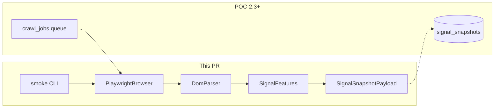

# POC-2.1 — Playwright + DOM metrics → SignalSnapshotPayload

> **Updated:** Reflects current naming conventions (`SignalFeatures`, `schema_version: v1`, `ENV=local`) and canonical schema location in backend — see [`AGENTS.md`](../../AGENTS.md) and [`docs/plans/2026-07-05-phased-build-plan.md`](../../docs/plans/2026-07-05-phased-build-plan.md).

## Phase verification (P0 + POC-1)

Prior phases are **complete per** [`docs/plans/2026-07-05-phased-build-plan.md`](../../docs/plans/2026-07-05-phased-build-plan.md). Before coding, run these checks:

| Check | Command / artifact | Expected |
|-------|-------------------|----------|
| P0 schema | `backend/alembic/versions/001_initial_schema.py` | `urls`, `crawl_jobs`, `signal_snapshots`, `classifications`, `audit_events` |
| Ingestion API | [`backend/src/mfa/api/v1/urls.py`](../../backend/src/mfa/api/v1/urls.py) | `POST /api/v1/urls`, `GET /api/v1/jobs/{id}` |
| Signals API | [`backend/src/mfa/api/v1/signals.py`](../../backend/src/mfa/api/v1/signals.py) | `GET /api/v1/signals/{url_id}` |
| Signal schema | [`backend/src/mfa/schemas/signals.py`](../../backend/src/mfa/schemas/signals.py) | `SignalFeatures` (16 fields), `SignalSnapshotPayload`, `SIGNAL_SCHEMA_VERSION = "v1"` |
| Gold labels | `python scripts/seed/validate_gold_labels.py` | Exit 0 |
| Unit tests | `uv run --directory backend pytest` | All pass (includes legacy `poc-v1` read compat test) |
| Crawler gap | [`crawler/src/mfa_crawler/worker.py`](../../crawler/src/mfa_crawler/worker.py) | Stub only — **no Playwright, no DOM parser** (expected) |

**POC-1.1 note:** Automated validation is done; Ad Ops sign-off is still pending (non-blocking for POC-2).

---

## Naming and conventions (do not regress)

Per [`AGENTS.md`](../../AGENTS.md) and updated skills/agents:

| Use in new code | Avoid |
|-----------------|-------|
| `SignalFeatures`, `SignalSnapshotPayload` | `POCFeatureSignals`, `Mvp*` prefixes |
| `schema_version: v1` (via `SIGNAL_SCHEMA_VERSION`) | `poc-v1` in new writes |
| `CRAWL_FEATURE_NAMES`, `ENRICHMENT_FEATURE_NAMES` | `POC_FEATURE_NAMES`, `MVP_ONLY_*` |
| `TODO(MVP):` comments for deferred scope | Phase names in class/module names |
| `ENV=local` | `ENV=poc` |

- **`to_db()`** always normalizes writes to `schema_version: v1`
- **`from_db()`** accepts legacy `poc-v1` reads and maps to `v1`
- Refresh fields (`refresh_events_60s`, `avg_refresh_interval_sec`) stay `null` until dwell is wired — per [`docs/SIGNALS.md`](../../docs/SIGNALS.md)
- Dual-persona / S3 / SQS: mark with `TODO(MVP):` — start with `direct` persona only

---

## Scope for this work

Per Sprint 1 mapping in the phased plan:

- **In scope:** POC-2.1 (Playwright + Docker) + POC-2.2 core (5 DOM metrics → `SignalFeatures` → `SignalSnapshotPayload`) + smoke CLI
- **Out of scope (next tasks):** POC-2.3 DB persist, POC-2.4 local artifacts, POC-2.6 queue worker wiring



---

## Architecture decision: schema import (revised)

**Previous plan (superseded):** Move schemas to `mfa-common`.

**Current convention:** Canonical schema lives in [`backend/src/mfa/schemas/signals.py`](../../backend/src/mfa/schemas/signals.py). Do **not** relocate or duplicate.

**Circular dependency fix:**

- [`backend/pyproject.toml`](../../backend/pyproject.toml) lists `mfa-crawler` but **never imports it** — remove this unused dep
- Add `mfa-backend` workspace dep to [`crawler/pyproject.toml`](../../crawler/pyproject.toml)
- Crawler imports: `from mfa.schemas.signals import SignalFeatures, SignalSnapshotPayload, compute_evidence_hash`
- Update [`crawler/Dockerfile`](../../crawler/Dockerfile) to `COPY backend/src/` so `mfa-backend` resolves in the image

API-only types (`SignalSnapshotResponse`, `Persona`) remain backend-only; crawler only needs payload + feature models.

---

## Implementation plan

### 1. Break circular workspace dependency

- Remove `mfa-crawler` from [`backend/pyproject.toml`](../../backend/pyproject.toml) `dependencies` and `[tool.uv.sources]`
- Add to [`crawler/pyproject.toml`](../../crawler/pyproject.toml):

```toml
dependencies = [
    "mfa-common",
    "mfa-backend",
    "playwright>=1.49",
]

[tool.uv.sources]
mfa-common = { workspace = true }
mfa-backend = { workspace = true }
```

- Run `uv lock` from repo root

### 2. Playwright dependency + browser module (POC-2.1)

**New module:** `crawler/src/mfa_crawler/browser.py`

- `CrawlSettings` dataclass: `timeout_ms`, `user_agent`, `headless` (env-driven, default `ENV=local`)
- `async with crawl_page(url) -> Page` context manager using Chromium
- Identifiable user-agent per [`.cursor/rules/mfa-crawler.mdc`](../../.cursor/rules/mfa-crawler.mdc)
- Handle navigation errors cleanly (log + re-raise for caller)
- `persona="direct"` only; referral referrer header — `TODO(MVP):`

### 3. Dockerfile browser install (POC-2.1)

Update [`crawler/Dockerfile`](../../crawler/Dockerfile):

- `COPY backend/src/ /app/backend/src/` (after sync, alongside existing `backend/pyproject.toml`)
- Install Playwright OS deps via `playwright install-deps chromium`
- After `uv sync`, run `uv run --package mfa-crawler playwright install chromium`

```dockerfile
RUN uv sync --frozen --package mfa-crawler --no-dev \
    && uv run --package mfa-crawler playwright install-deps chromium \
    && uv run --package mfa-crawler playwright install chromium
```

### 4. DOM parser — 5 core metrics (POC-2.2)

**New module:** `crawler/src/mfa_crawler/dom_parser.py`

Extract Sprint 1 subset per [`docs/SIGNALS.md`](../../docs/SIGNALS.md) into `SignalFeatures` field names:

| Feature | Extraction approach |
|---------|---------------------|
| `ad_slots_count` | Count elements: `iframe[src*='doubleclick']`, `[id*='ad-']`, `[class*='ad-slot']`, `ins.adsbygoogle`, etc. |
| `ads_above_fold` | Ad elements with `getBoundingClientRect().top < window.innerHeight` |
| `sticky_ad_count` | Ad elements with `position: fixed\|sticky` via `getComputedStyle` |
| `content_word_count` | Visible text from `article`, `main`, or `body` — strip scripts/styles, split words |
| `ad_to_content_ratio` | Sum of ad bounding-box areas / content area (0–1) |

**Null conventions:**

- Measured zero → `0` / `0.0`
- Unimplemented fields (refresh, enrichment, remaining crawl features) → `null`
- Parser populates 5 fields; remaining 11 `CRAWL_FEATURE_NAMES` stay `null`

Use `page.evaluate()` with a single injected JS function.

### 5. Wire crawl → SignalSnapshotPayload

**New module:** `crawler/src/mfa_crawler/crawl.py`

```python
async def crawl_url(url: str, *, persona: str = "direct") -> tuple[SignalSnapshotPayload, float]:
    """Navigate, extract DOM metrics, return validated payload + duration_sec."""
```

- Record `crawl_ts` at extraction time (UTC)
- Build `SignalFeatures(**dom_metrics)` then `SignalSnapshotPayload(crawl_ts=..., features=...)`
- `payload.to_db()` must emit `schema_version: "v1"` (not `poc-v1`)
- Return payload + duration for future DB writer (POC-2.3)

### 6. Smoke test + crawler tests

**CLI:** `crawler/src/mfa_crawler/smoke.py` (`python -m mfa_crawler.smoke`)

- Navigate `https://example.com`
- Print `SignalSnapshotPayload.to_db()` JSON
- Exit 0 on success

**Tests** in `crawler/tests/`:

| Test | Type |
|------|------|
| `test_dom_parser.py` | Unit — mock `evaluate` results or HTML fixture |
| `test_signal_payload.py` | Unit — DOM dict → `SignalFeatures` → `SignalSnapshotPayload` via `mfa.schemas.signals` |
| `test_browser_smoke.py` | Integration — `@pytest.mark.integration`, skip unless `PLAYWRIGHT_SMOKE=1` |

Add `[tool.pytest.ini_options]` to [`crawler/pyproject.toml`](../../crawler/pyproject.toml).

**Local dev:** `uv sync --all-packages` then `uv run --package mfa-crawler playwright install chromium` once.

### 7. Worker stub — no queue yet

[`crawler/src/mfa_crawler/worker.py`](../../crawler/src/mfa_crawler/worker.py) already documents pending Playwright wiring. Keep stub loop; queue consumption is POC-2.6 / `TODO(MVP):` for SQS.

---

## File change summary

| File | Action |
|------|--------|
| `backend/pyproject.toml` | Remove unused `mfa-crawler` dep |
| `crawler/pyproject.toml` | Add `mfa-backend`, `playwright`, pytest config |
| `crawler/Dockerfile` | Browser deps + `backend/src` copy + `playwright install` |
| `crawler/src/mfa_crawler/browser.py` | **New** |
| `crawler/src/mfa_crawler/dom_parser.py` | **New** |
| `crawler/src/mfa_crawler/crawl.py` | **New** |
| `crawler/src/mfa_crawler/smoke.py` | **New** |
| `crawler/tests/test_*.py` | **New** |
| `uv.lock` | Regenerated |

**No changes** to [`backend/src/mfa/schemas/signals.py`](../../backend/src/mfa/schemas/signals.py) — schema is already updated.

---

## Verification checklist (post-implementation)

```bash
# 1. Baseline still green
uv run --directory backend pytest
python scripts/seed/validate_gold_labels.py

# 2. Crawler unit tests
uv run --directory crawler pytest -m "not integration"

# 3. Local Playwright smoke
uv run --package mfa-crawler playwright install chromium
uv run --package mfa-crawler python -m mfa_crawler.smoke

# 4. Docker smoke
docker compose --profile workers build crawler-worker
docker compose --profile workers run --rm crawler-worker \
  uv run --package mfa-crawler python -m mfa_crawler.smoke
```

**Acceptance criteria:**

- Playwright navigates `example.com` locally and in Docker
- 5 DOM metrics use `CRAWL_FEATURE_NAMES` from SIGNALS.md
- Output validates as `SignalSnapshotPayload`; `to_db()` emits `schema_version: "v1"`
- No `POC*` / `poc-v1` identifiers introduced in new crawler code

---

## Immediate follow-ups (not in this PR)

| ID | Task |
|----|------|
| POC-2.3 | Insert `signal_snapshots` row + `compute_evidence_hash` + `persona=direct` |
| POC-2.4 | Write screenshot/HTML/`dom_metrics.json` to `backend/evidence/{url_id}/{version}/` |
| POC-2.2+ | Remaining 11 crawl features (refresh dwell, native ads, etc.) |
| POC-2.6 | Queue consumer + `crawl_jobs.status` transitions |
