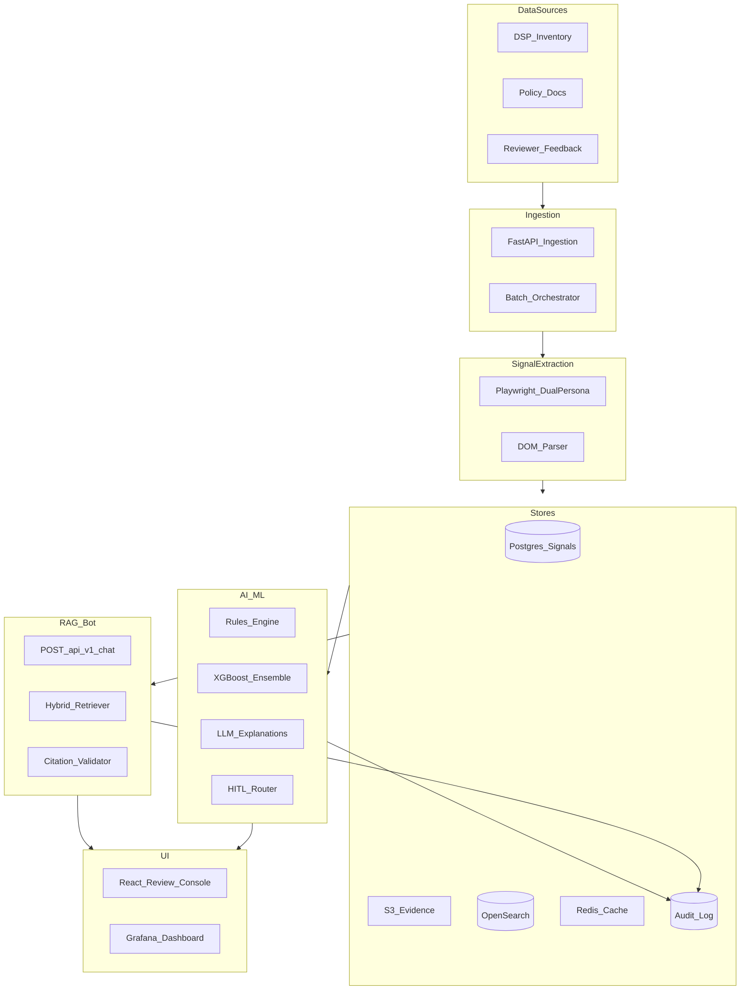

# MFA Detection Platform — Case Study Submission

**Role:** Lead / Solution Architect  
**Date:** 2026-07-10  
**Status:** Baseline complete; MVP implementation in progress

---

## 1. Executive Summary

The MFA Detection Platform is a **multi-signal, hybrid ML + LLM system** that ingests ad-inventory URLs, extracts page-level evidence via headless crawling, scores MFA risk with calibrated confidence, explains decisions with cited signals, routes uncertain cases to human reviewers, and exposes a **RAG bot** grounded in structured signals and policy corpora.

**Implementation status:** Baseline (POC-1 → POC-5) is **complete** with live batch eval on 615 gold-label URLs. MVP capabilities (dual-persona crawl, RAG v1, review console, Terraform infra) are **implemented** in this repository.

---

## 2. Architecture Diagram

See [`.cursor/plans/mfa_platform_architecture_48645023.plan.md`](../.cursor/plans/mfa_platform_architecture_48645023.plan.md) Section 1.

---

## 3. Architecture Decision Records

Full ADRs: [`docs/ADRS.md`](ADRS.md)

| ADR | Decision | Rationale |
|-----|----------|-----------|
| ADR-001 | Hybrid rules + ML + LLM (LLM not classifier) | Precision at scale; auditability |
| ADR-002 | Page-section granularity, tiered output | Homepage ≠ article; ANA/DV guidance |
| ADR-003 | Dual-persona Playwright crawl | Referral/direct delta is top MFA tell |
| ADR-004 | OpenSearch k-NN + BM25 hybrid | Exact + semantic retrieval for RAG |
| ADR-005 | Tiered LLM (Haiku explanations, Sonnet RAG) | Cost control |
| ADR-006 | Event-driven microservices (ECS + SQS) | Decouple crawl latency from API |
| ADR-007 | Postgres + S3 feature store (MVP) | Feast deferred until sub-100ms serving |
| ADR-008 | DSP inbound + blocklist outbound | Integration with ad ops workflows |
| ADR-009 | AWS primary | Kinesis, OpenSearch, Step Functions maturity |

---

## 4. Data Signals Research

See architecture plan Section 2 and [`docs/SIGNALS.md`](SIGNALS.md).

**Tier 1 (highest value):** ad density/clutter, ad refresh (60s dwell), traffic source skew, referral vs direct delta, content quality.

**Tier 2 (supporting):** domain metadata, sellers.json, campaign CTR anomalies, page-level section scoring.

**Tier 3 (HITL/RAG):** reviewer overrides, historical versions, policy documents.

**Batch eval insight (2026-07-10):** Ad-density-only signals cause false positives; dual-persona + enrichment required for production precision.

---

## 5. RAG Bot Architecture

See [`docs/RAG.md`](RAG.md) and `backend/src/mfa/rag/`.

| Query | Retrieval |
|-------|-----------|
| "Why is X MFA?" | SQL: latest classification + signals |
| "Which signals contributed?" | SHAP / top_signals |
| "What changed since last review?" | Snapshot version diff |
| "Similar MFA sites" | OpenSearch k-NN (Production RAG v2) |

**Response contract:** `answer`, `confidence`, `citations[]`, `top_signals[]`, `recommended_action`, `limitations`.

**Anti-hallucination:** retrieve-first, citation validator, insufficient-evidence escalation.

---

## 6. Risk & Guardrail Design

See [`docs/GUARDRAILS.md`](GUARDRAILS.md).

| Risk | Control |
|------|---------|
| Hallucination | Citation validator; structured RAG output |
| Prompt injection | Input sanitizer on chat queries |
| False positives | Tiered output; HITL queue; tier recalibration (MVP-2.2) |
| False negatives | Reviewer feedback loop; re-crawl schedule |
| Data leakage | RBAC stub; tenant isolation (Production) |
| Reviewer override | Mandatory reason code; ML score preserved |
| Auditability | Append-only audit_events with evidence_hash |

---

## 7. MVP vs Production Roadmap

| Phase | Duration | Status |
|-------|----------|--------|
| **Baseline (POC)** | 6–8 weeks | ✅ Complete (2026-07-10) |
| **MVP** | 10–12 weeks | 🟡 Implemented in repo |
| **Production** | 12–16 weeks | ⏳ Stubs + plan documented |

**MVP in scope:** dual-persona crawl, RAG v1, review console, LLM explanations, Terraform, Redis, blocklist export, shadow mode runbook.

**Production in scope:** NRT &lt;5 min, pre-bid API, auto-retrain, RAG v2, SSO/DR.

**Excluded:** CTV/mobile MFA, federated learning, sub-second pre-bid (MVP).

---

## 8. Estimation

| Item | Value |
|------|-------|
| Team (peak MVP) | ~7–8 FTE |
| Cumulative timeline | ~8–9 months (POC → Production) |
| Infra cost (500K URLs/mo) | $8K–$23K/mo AWS |
| Infra cost (5M URLs/mo) | $40K–$90K/mo AWS |

---

## 9. Cloud Service Mapping

| Capability | AWS | Azure | GCP |
|------------|-----|-------|-----|
| API / auth | API Gateway + Cognito | API Mgmt + Entra ID | Cloud Endpoints |
| Crawler | ECS Fargate + SQS | Container Apps | Cloud Run |
| DB | RDS PostgreSQL | Azure DB for PostgreSQL | Cloud SQL |
| Cache | ElastiCache Redis | Azure Cache | Memorystore |
| Vector | OpenSearch Serverless | Azure AI Search | Vertex Vector Search |
| LLM | Bedrock | Azure OpenAI | Vertex AI Gemini |
| Artifacts | S3 | Blob Storage | Cloud Storage |
| Batch | Step Functions | Data Factory | Cloud Composer |

Terraform modules: [`infra/terraform/`](../infra/terraform/)

---

## 10. Live Implementation Evidence

| Artifact | Path |
|----------|------|
| Batch eval report | `ml/artifacts/v1/batch_eval_report.json` |
| Live metrics | `ml/artifacts/v1/metrics.json` (18.9% precision, 55.2% recall) |
| Eval analysis | `ml/artifacts/v1/eval_notes.md` |
| E2E walkthrough | `docs/LOCAL_DEV_GUIDE.md` §7.14 |
| Review console | `frontend/` |
| RAG chat API | `POST /api/v1/chat` |
| Ad Ops checklist | `docs/plans/adops-signoff-checklist.md` |

---

## 11. Baseline Metrics & Remediation

| Metric | Result | Target |
|--------|--------|--------|
| Crawl success | 46.0% | ≥90% |
| Precision | 18.9% | ≥85% |
| Recall | 55.2% | ≥70% |

**Remediation:** Ad Ops seed refresh + MVP-2.1 feature expansion + MVP-2.2 tier recalibration.

---

## References

- [`docs/ARCHITECTURE.md`](ARCHITECTURE.md)
- [`docs/ROADMAP.md`](ROADMAP.md)
- [`docs/plans/2026-08-mvp-execution.md`](plans/2026-08-mvp-execution.md)
- [`.cursor/plans/mfa_platform_architecture_48645023.plan.md`](../.cursor/plans/mfa_platform_architecture_48645023.plan.md)
