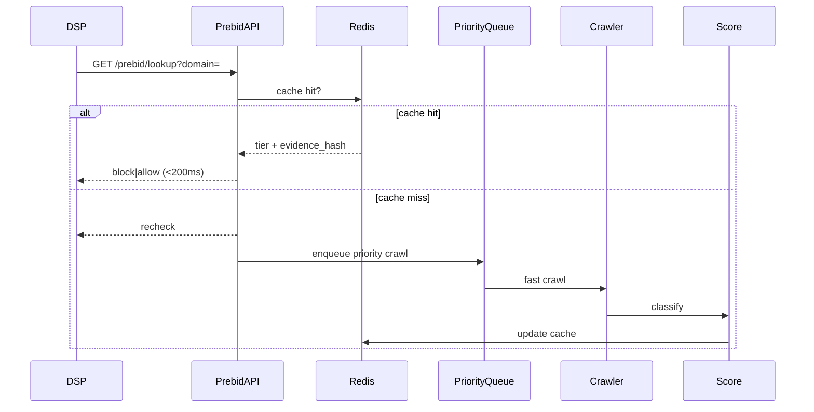

# Production Scale Plan — Implementation Stubs

Parent: [`docs/plans/2026-11-production-execution.md`](plans/2026-11-production-execution.md)

## Implemented stubs (local)

| Component | Path | Notes |
|-----------|------|-------|
| Pre-bid lookup | `GET /api/v1/prebid/lookup` | Redis-backed domain cache; <200ms target in prod |
| Priority ingest | `POST /api/v1/urls` `priority` field | SQS FIFO migration in Terraform |
| OpenSearch | `backend/src/mfa/rag/opensearch_client.py` | SQL fallback until `OPENSEARCH_ENDPOINT` set |

## Production deliverables (not yet deployed)

| Task | Deliverable |
|------|-------------|
| PROD-1.1 | SQS FIFO priority queue — P95 ingest→classify <5 min |
| PROD-1.2 | Pre-bid API SLA monitoring — CloudWatch P95 <200ms |
| PROD-1.3 | ECS autoscale 5→30 workers on queue depth |
| PROD-1.4 | Step Functions nightly batch — millions of URLs |
| PROD-2.1 | Monthly auto-retrain pipeline |
| PROD-2.2 | Drift monitoring — PSI → CloudWatch alarms |
| PROD-3.1 | RAG v2 similar-domain k-NN |
| PROD-4.1 | SSO (Okta) + full RBAC |
| PROD-4.3 | Multi-region DR |

## Near-real-time path

## Cost controls (Production)

- Crawl budget per domain per day
- LLM token caps on explanations + RAG
- 24h RAG response cache keyed by `evidence_hash`
- Batch crawl off-peak via Step Functions schedule
