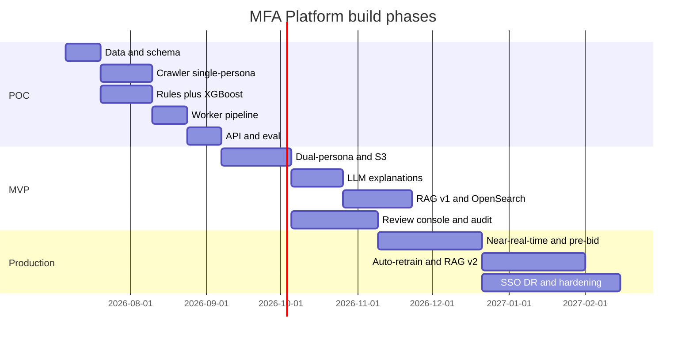
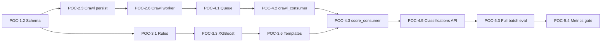

# MFA Platform — Phased Build Plan

**Created:** 2026-07-05  
**Scope:** Baseline → MVP → Production (task IDs retain `POC-*` labels from planning — not used in code)  
**References:** [`docs/ROADMAP.md`](../ROADMAP.md), [`docs/ARCHITECTURE.md`](../ARCHITECTURE.md), [`AGENTS.md`](../../AGENTS.md)

> **Naming:** Implementation code uses `SignalFeatures`, `schema_version: v1`, `ENV=local`. Defer scope via `TODO(MVP):` comments, not class prefixes.

---

## Current baseline (completed)

| ID | Task | Status |
|----|------|--------|
| P0-01 | Monorepo layout (`backend/`, `crawler/`, `ml/`, `common/`) | ✅ Done |
| P0-02 | uv workspace + root `uv.lock` | ✅ Done |
| P0-03 | Root `docker-compose.yml` + per-service Dockerfiles | ✅ Done |
| P0-04 | Shared JSON logging (`mfa-common`) | ✅ Done |
| P0-05 | Postgres schema + Alembic migration (`urls`, `crawl_jobs`, `signal_snapshots`, `classifications`, `audit_events`) | ✅ Done |
| P0-06 | Ingestion API — `POST /api/v1/urls`, `GET /api/v1/jobs/{id}` | ✅ Done |
| P0-07 | URL normalizer + idempotency (`url_hash` + `source_batch_id`) | ✅ Done |
| P0-08 | In-memory queue stub + worker container stubs | ✅ Done |
| P0-09 | Gold-label seed dataset (`data/seed/`, 600+ URLs) | ✅ Done |
| P0-10 | README + AGENTS local dev documentation | ✅ Done |
| POC-1.1 | Gold-label validation + Ad Ops review doc (`data/seed/README.md`) | ✅ Done (automated); Ad Ops sign-off pending |
| POC-1.2 | Crawl feature subset in `docs/SIGNALS.md` | ✅ Done |
| POC-1.3 | Pydantic `SignalSnapshot` schema (`SignalFeatures` in `schemas/signals.py`) | ✅ Done |
| POC-1.4 | `GET /api/v1/signals/{url_id}` | ✅ Done |
| POC-1.5 | Batch ingest CLI (`scripts/seed/ingest_gold_labels.py`) | ✅ Done |

**Next milestone:** POC-2 — Playwright crawler + DOM metrics → persist `signal_snapshots`.

---

## Phase overview

| Phase | Duration | Success gate |
|-------|----------|--------------|
| **POC** | 6–8 weeks | Precision ≥85%, Recall ≥70%; top-5 signal explanations |
| **MVP** | +10–12 weeks | Operational pilot; RAG v1; reviewer console; shadow mode |
| **Production** | +12–16 weeks | &lt;5 min near-real-time; pre-bid API; SSO; multi-region DR |

---

# POC (6–8 weeks)

**In scope:** Single-persona crawl, ad density + content heuristics, rules + XGBoost, template explanations, Postgres only, basic reviewer workflow (spreadsheet or minimal UI).

**Out of scope:** RAG, dual-persona, LLM explanations, OpenSearch, Redis, S3 (optional local filesystem for POC artifacts).

---

## POC-1 — Data & signal schema (Week 1–2)

| ID | Task | Layer | Deps | Acceptance criteria |
|----|------|-------|------|---------------------|
| POC-1.1 | Validate gold labels with Ad Ops (`scripts/seed/validate_gold_labels.py` + manual review sample) | Data | — | Sign-off on label distribution; document in `data/seed/README.md` | ✅ |
| POC-1.2 | Finalize POC feature subset (~15–20 features) in `docs/SIGNALS.md` | ML/Signals | POC-1.1 | POC feature list marked; null vs 0 conventions documented | ✅ |
| POC-1.3 | Add Pydantic `SignalSnapshot` schema matching JSONB store | Backend | POC-1.2 | Validated model; unit tests for schema round-trip | ✅ |
| POC-1.4 | Implement `GET /api/v1/signals/{url_id}` (versioned snapshots) | API | POC-1.3 | Returns snapshots; pagination by version | ✅ |
| POC-1.5 | Batch ingest CLI — load `gold_labels.jsonl` via ingestion API | Scripts | P0-06 | Script ingests N URLs; reports job IDs | ✅ |

---

## POC-2 — Crawler (single-persona) (Week 2–4)

| ID | Task | Layer | Deps | Acceptance criteria |
|----|------|-------|------|---------------------|
| POC-2.1 | Add Playwright to `mfa-crawler`; local + Docker base image with browsers | Crawler | P0-03 | `playwright install` in Dockerfile; smoke test navigates example.com |
| POC-2.2 | DOM parser — `ad_to_content_ratio`, `ads_above_fold`, `ad_slots_count`, `sticky_ad_count`, `content_word_count` | Crawler | POC-2.1 | Metrics JSON matches `docs/SIGNALS.md` names |
| POC-2.3 | Single-persona crawl (`direct` only); persist `signal_snapshots` + `evidence_hash` | Crawler | POC-2.2, POC-1.3 | Crawl writes JSONB row; `persona=direct` |
| POC-2.4 | Store artifacts locally for POC (`backend/evidence/` or configurable path; S3 deferred) | Crawler | POC-2.3 | Screenshot + HTML + `dom_metrics.json` per url_id/version |
| POC-2.5 | Crawler spike on 100 domains from `domains_summary.csv` | Crawler | POC-2.4 | Report: success rate, median crawl time, top DOM metrics |
| POC-2.6 | Wire `crawler-worker` — consume queue, update `crawl_jobs.status` | Workers | POC-2.3, POC-4.1 | Job transitions: `queued` → `running` → `completed`/`failed` |

---

## POC-3 — ML scoring (rules + XGBoost) (Week 2–4, parallel with POC-2)

| ID | Task | Layer | Deps | Acceptance criteria |
|----|------|-------|------|---------------------|
| POC-3.1 | Rules engine v1 — high-confidence patterns (ad density + refresh placeholders) | ML | POC-1.2 | Rules return tier + `top_signals`; unit tests per rule |
| POC-3.2 | Training pipeline — load gold labels + features; domain-level train/val split | ML | POC-1.1, POC-2.5 | `ml/scripts/train.py`; metrics JSON in `ml/artifacts/` |
| POC-3.3 | XGBoost classifier + basic calibration (Platt or isotonic) | ML | POC-3.2 | Model artifact versioned with feature schema version |
| POC-3.4 | Tier mapper — `MFA_High` / `Medium` / `Low` / `Non_MFA` / `Uncertain` | ML | POC-3.3 | Mapping table in code matches `docs/DOMAIN.md` |
| POC-3.5 | SHAP or rule attribution → `top_signals` (top 5) | ML | POC-3.3 | Each classification has ranked contributions |
| POC-3.6 | Template explanations (Jinja2) citing `top_signals` only | Backend | POC-3.5 | No LLM; explanation references signal names/values |
| POC-3.7 | Evaluate on holdout — precision ≥85%, recall ≥70% | ML | POC-3.3 | Evaluation report committed to `ml/artifacts/{version}/metrics.json` |

---

## POC-4 — Async worker pipeline (Week 4–5)

| ID | Task | Layer | Deps | Acceptance criteria |
|----|------|-------|------|---------------------|
| POC-4.1 | Replace `InMemoryQueue` with Redis or Postgres-backed job poll (POC-simple) | Backend | P0-08 | API enqueue survives process restart (Redis preferred if added to compose) |
| POC-4.2 | `crawl_consumer` — dequeue → crawl → write snapshot → enqueue score job | Workers | POC-2.6, POC-4.1 | End-to-end job flow without manual steps |
| POC-4.3 | `score_consumer` in `ml-worker` — load snapshot → classify → write `classifications` | Workers | POC-3.6, POC-4.2 | Classification row has full output contract |
| POC-4.4 | Audit writer — append `audit_events` on ingest, crawl complete, classify | Backend | P0-05 | Every score has `event_id`, `evidence_hash`, `payload` |
| POC-4.5 | `GET /api/v1/classifications/{url_id}` — latest + history | API | POC-4.3 | Returns tier, score, confidence, top_signals, explanation |

---

## POC-5 — API polish & POC evaluation (Week 5–6)

| ID | Task | Layer | Deps | Acceptance criteria |
|----|------|-------|------|---------------------|
| POC-5.1 | Structured error codes on all endpoints; OpenAPI examples | API | POC-4.5 | `/docs` shows request/response examples |
| POC-5.2 | List endpoints — jobs/classifications filter by `tier`, `domain`, `status` | API | POC-4.5 | Pagination + filters work |
| POC-5.3 | Run full gold-label batch through pipeline; error report | QA | POC-4.5 | ≥90% URLs crawl successfully |
| POC-5.4 | Confusion matrix + per-tier breakdown vs gold labels | ML | POC-5.3 | Meets precision/recall targets or documents gap |
| POC-5.5 | Basic reviewer export — CSV of uncertain/medium cases for HITL | Data | POC-5.3 | Ad Ops can review in spreadsheet |
| POC-5.6 | POC demo script + update README with E2E walkthrough | Docs | POC-5.4 | New developer can run crawl→score in &lt;30 min |

---

## POC exit checklist

- [ ] Precision ≥85%, Recall ≥70% on gold-label holdout
- [ ] Every score emits: `tier`, `mfa_score`, `confidence`, `top_signals`, `explanation`, `evidence_hash`
- [ ] Crawl + score off hot API path (async workers)
- [ ] Audit row for each classification
- [ ] Ad Ops sign-off on sample explanations

---

# MVP (+10–12 weeks after POC)

**In scope:** Dual-persona crawl, 60s refresh detection, S3 artifacts, tiered calibration, LLM explanations, RAG v1, reviewer console, OpenSearch, Redis, audit v1, QuickSight (optional).

**Out of scope:** Sub-second pre-bid, mobile/CTV, auto-retrain, multi-tenant SaaS hardening.

---

## MVP-1 — Infrastructure & crawl upgrade (Weeks 1–4)

| ID | Task | Layer | Deps | Acceptance criteria |
|----|------|-------|------|---------------------|
| MVP-1.1 | Terraform POC env — RDS, S3, SQS, ECS task defs (or LocalStack dev parity) | Infra | POC exit | `infra/terraform/` applies in `poc` env |
| MVP-1.2 | S3 evidence artifacts (replace local path); signed URL proxy in API | Infra/API | MVP-1.1 | No raw S3 URLs in public API |
| MVP-1.3 | SQS queues — batch + priority; replace Redis/Postgres poll | Workers | MVP-1.1 | Crawl and score consumers on SQS |
| MVP-1.4 | Dual-persona crawl — `direct` + simulated Taboola/Outbrain referrer | Crawler | POC exit | `referral_direct_delta_score` computed |
| MVP-1.5 | 60s dwell + `refresh_events_60s`, `avg_refresh_interval_sec` | Crawler | MVP-1.4 | Refresh metrics on signal snapshot |
| MVP-1.6 | Redis cache — domain tier + `evidence_hash` (24h TTL) | Backend | MVP-1.1 | Cache hit on repeat classification lookup |

---

## MVP-2 — Scoring & explanations (Weeks 3–6)

| ID | Task | Layer | Deps | Acceptance criteria |
|----|------|-------|------|---------------------|
| MVP-2.1 | Expand feature set toward 40–60 MVP features per `docs/SIGNALS.md` | ML/Signals | MVP-1.4 | Schema version bump; migration doc |
| MVP-2.2 | Confidence calibrator productionized; shadow thresholds | ML | POC-3.4 | `confidence` = high/medium/low validated on holdout |
| MVP-2.3 | HITL router — Medium + Uncertain → review queue table | Backend | MVP-2.2 | Queue API or DB view for reviewers |
| MVP-2.4 | Bedrock LLM explanations with retrieved signals only (ADR-001) | Backend | MVP-2.2 | Explanation cites signal snapshot IDs |
| MVP-2.5 | `POST /api/v1/reviews` — override with `override_reason` enum | API | MVP-2.3 | ML score preserved; `final_label` stored |
| MVP-2.6 | `GET /api/v1/blocklist` — export segment by tier | API | MVP-2.2 | Filter by tier/confidence; pagination |

---

## MVP-3 — RAG v1 (Weeks 5–8)

| ID | Task | Layer | Deps | Acceptance criteria |
|----|------|-------|------|---------------------|
| MVP-3.1 | OpenSearch Serverless index — signals, explanations, policy chunks | RAG/Infra | MVP-1.1 | Hybrid BM25 + k-NN with metadata filters |
| MVP-3.2 | Indexing worker — chunk by `doc_type` per `docs/RAG.md` | RAG | MVP-3.1 | Chunks have `domain`, `url_id`, `signal_version` |
| MVP-3.3 | Query router — SQL vs vector by intent | RAG | MVP-3.2 | “Why is X MFA?” → SQL first |
| MVP-3.4 | Evidence packager + Bedrock generation | RAG | MVP-3.3 | Response matches `RAGResponse` contract |
| MVP-3.5 | Citation validator — every claim maps to chunk ID | RAG | MVP-3.4 | Invalid citations trigger regenerate or `insufficient` |
| MVP-3.6 | `POST /api/v1/chat` + input sanitizer | API | MVP-3.5 | Audit log per query; `recommended_action` required |
| MVP-3.7 | RAG response cache keyed by `evidence_hash` (24h) | RAG | MVP-1.6 | Cache hit/miss metrics |

---

## MVP-4 — Reviewer console & observability (Weeks 4–10)

| ID | Task | Layer | Deps | Acceptance criteria |
|----|------|-------|------|---------------------|
| MVP-4.1 | Frontend bootstrap — Vite + React + TypeScript | UI | POC exit | `frontend/` builds; talks to API |
| MVP-4.2 | Review queue UI — filter, detail, signal viz | UI | MVP-2.3 | Reviewer sees top_signals + explanation |
| MVP-4.3 | Override workflow — reason codes, notes, submit | UI | MVP-2.5 | Override reflected in API + audit |
| MVP-4.4 | Bot UI stub — chat interface to `/api/v1/chat` | UI | MVP-3.6 | Citations rendered in UI |
| MVP-4.5 | Immutable audit export — DynamoDB or append-only Postgres | Infra | MVP-2.5 | Matches `docs/GUARDRAILS.md` fields |
| MVP-4.6 | API Gateway + Cognito auth middleware | Infra/API | MVP-4.1 | RBAC stub: `reviewer`, `read_only` |
| MVP-4.7 | QuickSight or Grafana dashboard — MFA rate, queue depth | Ops | MVP-4.5 | Ops can monitor throughput |

---

## MVP-5 — Pilot (Weeks 10–12)

| ID | Task | Layer | Deps | Acceptance criteria |
|----|------|-------|------|---------------------|
| MVP-5.1 | Shadow mode — score inventory without enforcing blocks | Ops | MVP-2.6 | 4-week shadow run documented |
| MVP-5.2 | DSP inventory feed integration (CSV/S3 batch) | Ingestion | MVP-1.3 | Nightly batch job |
| MVP-5.3 | Pilot with 1–2 advertiser accounts | Product | MVP-5.1 | Sign-off for blocklist enablement |
| MVP-5.4 | Security review — RAG, auth, audit (mfa-security-reviewer) | Security | MVP-3.6 | Findings tracked and resolved |

---

## MVP exit checklist

- [ ] Dual-persona + refresh signals in production crawl path
- [ ] LLM explanations with citations; no LLM in classifier path
- [ ] RAG v1 passes citation validator on test query set
- [ ] Reviewer console override + audit trail end-to-end
- [ ] Shadow mode completed; blocklist export approved

---

# Production (+12–16 weeks after MVP)

**In scope:** Near-real-time (&lt;5 min), pre-bid API, monthly auto-retrain, RAG v2, drift monitoring, SSO/RBAC, multi-region DR, cost attribution.

---

## PROD-1 — Scale & near-real-time (Weeks 1–6)

| ID | Task | Layer | Deps | Acceptance criteria |
|----|------|-------|------|---------------------|
| PROD-1.1 | Priority SQS FIFO queue — new placements &lt;5 min SLA | Infra | MVP exit | P95 ingest→classification &lt;5 min |
| PROD-1.2 | Pre-bid API — domain cache lookup &lt;200ms | API | MVP-1.6 | Read replica / Redis hot path |
| PROD-1.3 | Auto-scaling crawler fleet (ECS) | Infra | PROD-1.1 | Scale on queue depth |
| PROD-1.4 | Step Functions nightly batch — millions of URLs | Infra | MVP-5.2 | Batch + NRT coexist per architecture |
| PROD-1.5 | Multi-AZ RDS + read replica | Infra | PROD-1.2 | Failover tested |

---

## PROD-2 — ML ops (Weeks 4–10)

| ID | Task | Layer | Deps | Acceptance criteria |
|----|------|-------|------|---------------------|
| PROD-2.1 | Monthly auto-retrain pipeline — gold labels + reviewer overrides | ML | MVP-5.3 | Scheduled retrain; model registry |
| PROD-2.2 | Drift monitoring — feature distribution alerts | ML/Ops | PROD-2.1 | CloudWatch alarms on PSI thresholds |
| PROD-2.3 | Shadow mode for model updates — A/B before promote | ML | PROD-2.1 | New model shadowed 2 weeks min |
| PROD-2.4 | Feast or DynamoDB online store (if sub-100ms required) | ML/Infra | PROD-1.2 | ADR update if adopted |

---

## PROD-3 — RAG v2 & intelligence (Weeks 6–12)

| ID | Task | Layer | Deps | Acceptance criteria |
|----|------|-------|------|---------------------|
| PROD-3.1 | Similar-domain k-NN search | RAG | MVP-3.1 | “Sites like X” returns tier-filtered results |
| PROD-3.2 | Signal snapshot diff — “what changed since last review?” | RAG | MVP-3.3 | Version diff tool in query router |
| PROD-3.3 | Reviewer feedback corpus indexed | RAG | MVP-4.3 | Overrides improve retrieval |
| PROD-3.4 | RAG eval suite — groundedness + citation accuracy | RAG | PROD-3.1 | Regression gate in CI |

---

## PROD-4 — Security & enterprise (Weeks 1–14)

| ID | Task | Layer | Deps | Acceptance criteria |
|----|------|-------|------|---------------------|
| PROD-4.1 | SSO (Okta) + full RBAC — admin, reviewer, ad_ops, auditor | Infra | MVP-4.6 | Role-scoped queues and APIs |
| PROD-4.2 | WAF + Shield; rate limiting on public APIs | Infra | PROD-1.2 | Pen test findings addressed |
| PROD-4.3 | Multi-region DR — OpenSearch + RDS cross-region | Infra | PROD-1.5 | DR runbook exercised |
| PROD-4.4 | Cost attribution per team/campaign | Ops | PROD-1.3 | QuickSight cost dashboard |
| PROD-4.5 | SOC2-aligned controls documentation | Security | PROD-4.1 | Audit trail 7-year retention configurable |

---

## PROD-5 — Launch (Weeks 12–16)

| ID | Task | Layer | Deps | Acceptance criteria |
|----|------|-------|------|---------------------|
| PROD-5.1 | Blocklist enforcement in DSP integration | Product | PROD-1.2 | Production traffic blocked per tier policy |
| PROD-5.2 | Slack alerts — high-spend MFA hits | Ops | PROD-1.1 | Alert SLA documented |
| PROD-5.3 | Runbook + on-call playbooks | Ops | PROD-4.3 | SLOs defined and monitored |
| PROD-5.4 | Global rollout after pilot sign-off | Product | PROD-5.1 | Go/no-go checklist complete |

---

# Suggested sprint mapping (POC)

| Sprint | Focus | Task IDs |
|--------|-------|----------|
| **Sprint 1** | Schema + batch ingest + Playwright spike | POC-1.1–1.5, POC-2.1–2.2 |
| **Sprint 2** | Crawl pipeline + DOM metrics on 100 domains | POC-2.3–2.6 |
| **Sprint 3** | Rules + XGBoost train/eval | POC-3.1–3.7 |
| **Sprint 4** | Workers + classification API + audit | POC-4.1–4.5 |
| **Sprint 5** | E2E eval + POC exit | POC-5.1–5.6 |

---

# Task dependency graph (POC critical path)

---

# How to use this plan

1. **Pick the current phase** — default is POC until exit checklist is complete.
2. **Pull tasks by ID** into your issue tracker (Jira/Linear/GitHub Issues).
3. **Mark status** in this file or link issues — e.g. `POC-2.1 [#42]`.
4. **Scope gate** — do not start MVP tasks until POC exit checklist passes (except spikes documented in ADRs).
5. **Agents** — use `.cursor/agents/` per layer (`mfa-crawler-engineer`, `mfa-ml-engineer`, etc.).

---

# Related documents

| Document | Purpose |
|----------|---------|
| [`docs/ROADMAP.md`](../ROADMAP.md) | Phase scope summary |
| [`docs/SIGNALS.md`](../SIGNALS.md) | Feature schema |
| [`docs/RAG.md`](../RAG.md) | RAG contract (MVP+) |
| [`docs/GUARDRAILS.md`](../GUARDRAILS.md) | Security controls |
| [`.cursor/plans/mfa_platform_architecture_48645023.plan.md`](../../.cursor/plans/mfa_platform_architecture_48645023.plan.md) | Full HLD |
