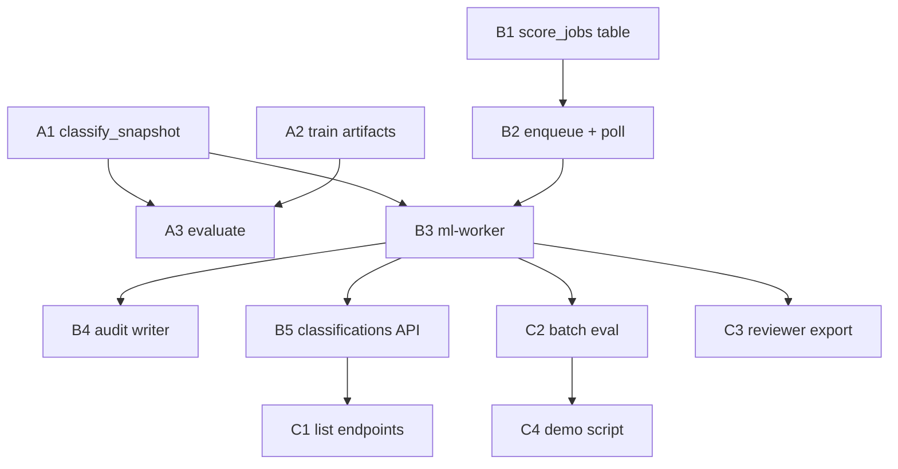

# Baseline Completion — POC-3.7 → POC-5

> **For agentic workers:** Use `subagent-driven-development` or layer-specific agents (`mfa-ml-engineer`, `mfa-crawler-engineer`) per task. Steps use checkbox (`- [ ]`) syntax.

**Goal:** Wire crawl → score → classify end-to-end, train/evaluate on real crawled gold labels, and pass the Baseline exit checklist so MVP work can begin.

**Architecture:** Postgres-backed job poll (existing pattern) extends to score jobs. A unified `classify_snapshot()` pipeline in `mfa-ml` combines rules → XGBoost → calibrator → tier → SHAP → Jinja2 templates. `ml-worker` polls score jobs; `backend-api` exposes classifications + audit. No Redis/SQS until MVP.

**Tech Stack:** Python 3.12 · FastAPI · SQLAlchemy async · XGBoost · SHAP · Jinja2 · Postgres JSONB · Docker Compose

**Parent plan:** [`2026-07-05-phased-build-plan.md`](2026-07-05-phased-build-plan.md)  
**Created:** 2026-07-06

---

## Status review (as of 2026-07-06)

### Completed ✅

| Area | Tasks | Evidence |
|------|-------|----------|
| Foundation | P0-01 → P0-10 | Monorepo, compose, Postgres schema, ingestion API |
| Data & schema | POC-1.1 → POC-1.5 | `SignalFeatures`, `GET /signals`, gold-label ingest CLI |
| Crawler | POC-2.1 → POC-2.6 | Playwright, DOM parser, persist, worker, 100-domain spike (84% success) |
| ML libraries | POC-3.1 → POC-3.6 | Rules, train CLI, XGBoost, calibrator, tier mapper, SHAP, templates — **unit tested, not wired** |
| Queue (partial) | POC-4.1 | Postgres `FOR UPDATE SKIP LOCKED` on `crawl_jobs` |

### In progress / blocked 🟡

| Gap | Impact |
|-----|--------|
| No trained model artifacts (`ml/artifacts/` empty) | Cannot score live URLs or run evaluate |
| No `classify_snapshot()` orchestrator | SHAP + templates exist in isolation |
| `ml-worker` is a 30s sleep stub | Score never runs in pipeline |
| Crawl does not enqueue score jobs | E2E stops at `signal_snapshots` |
| No classifications API or audit writer | Output contract has no runtime producer |
| POC-3.7 metrics unverified | Precision/recall gate unknown |

### Not started ❌

POC-4.3 → POC-4.5 (score consumer, audit, classifications API) · POC-5.1 → POC-5.6 (API polish, batch eval, reviewer export, demo)

### Current E2E path

```
POST /urls → crawl_jobs (queued) → crawler-worker → signal_snapshots + evidence
                                                              ↓
                                                         [STOPS HERE]
```

### Target E2E path

```
POST /urls → crawl_jobs → crawler-worker → signal_snapshots
                                                  ↓
                                            score_jobs (queued)
                                                  ↓
                                            ml-worker → classifications + audit_events
                                                  ↓
                              GET /classifications/{url_id}
```

---

## Sprint plan (3 sprints, ~3 weeks)

| Sprint | Focus | Task IDs | Exit criteria |
|--------|-------|----------|---------------|
| **Sprint A** | Score pipeline + train/eval | POC-3.7, POC-4.2 (partial), POC-4.3 | `classify_snapshot()` works; model trained; metrics.json exists |
| **Sprint B** | Workers + API + audit | POC-4.2–4.5 | Full crawl→score async; classifications API live |
| **Sprint C** | POC exit + polish | POC-5.1–5.6 | Batch eval ≥90% crawl; precision/recall documented; demo script |

---

## File map (new / modified)

| File | Responsibility |
|------|----------------|
| `ml/src/mfa_ml/scoring/pipeline.py` | **Create** — `classify_snapshot()` orchestrator |
| `ml/src/mfa_ml/scoring/artifact_loader.py` | **Create** — load model + calibrator from `ml/artifacts/{version}/` |
| `ml/src/mfa_ml/worker.py` | **Replace stub** — score job poll loop |
| `backend/src/mfa/ingestion/score_poll.py` | **Create** — claim/enqueue score jobs (mirror `job_poll.py`) |
| `backend/src/mfa/scoring/writer.py` | **Create** — persist `Classification` row |
| `backend/src/mfa/audit/writer.py` | **Create** — append `AuditEvent` |
| `backend/src/mfa/api/v1/classifications.py` | **Create** — `GET /classifications/{url_id}` |
| `backend/alembic/versions/002_score_jobs.py` | **Create** — `score_jobs` table |
| `crawler/src/mfa_crawler/consumer.py` | **Modify** — enqueue score job after crawl |
| `scripts/demo/e2e_crawl_score.sh` | **Create** — one-command demo |
| `scripts/export/reviewer_csv.py` | **Create** — POC-5.5 export |

---

## Sprint A — Score pipeline + train/eval

### Task A1: Unified scoring pipeline

**Files:**
- Create: `ml/src/mfa_ml/scoring/pipeline.py`
- Create: `ml/src/mfa_ml/scoring/artifact_loader.py`
- Test: `ml/tests/test_scoring_pipeline.py`

Pipeline contract:

```python
def classify_snapshot(
    signals: dict,
    *,
    evidence_hash: str,
    artifact_dir: Path,
) -> ClassificationOutput:
    """Rules → XGBoost → calibrator → tier → SHAP top-5 → Jinja2 explanation."""
```

- [ ] Load rules engine, classifier, calibrator via `artifact_loader.py`
- [ ] If rules return high-confidence tier, short-circuit (skip XGBoost)
- [ ] Otherwise run XGBoost + isotonic calibration
- [ ] Map tier via `map_tier()` + `calibrated_confidence_from_proba()`
- [ ] SHAP `explain()` → `top_signals` (max 5)
- [ ] `render_explanation(tier, top_signals)` from backend templates (import or duplicate thin wrapper in ml)
- [ ] Unit test with fixture signals dict + mock artifacts

**Note:** `render_explanation` lives in `backend/` — either move to `common/` or have ml import from backend (acceptable in uv workspace). Prefer `mfa_ml.scoring.explanation` thin wrapper calling Jinja2 templates copied/shared via path env `TEMPLATE_DIR`.

---

### Task A2: Train on crawled gold labels

**Deps:** Gold labels ingested + crawled in local Postgres (≥400 URLs with snapshots)

- [ ] Run batch ingest: `uv run python scripts/seed/ingest_gold_labels.py --limit 500`
- [ ] Start workers: `docker compose --profile workers up -d`
- [ ] Wait for crawl completion (monitor `crawl_jobs` status)
- [ ] Train: `uv run --package mfa-ml python ml/scripts/train.py --db-url $DATABASE_URL_SYNC --gold-labels data/seed/gold_labels.jsonl --artifact-dir ml/artifacts/v1`
- [ ] Verify artifacts: `model.pkl`, `calibrator.pkl`, `metadata.json`, `training_summary.json`

**Acceptance (POC-3.7 prep):** Artifacts committed or documented in `.gitignore` with CI artifact upload (prefer **not** committing large pickles — document path + regenerate instructions).

---

### Task A3: Evaluate on holdout

**Files:**
- Run: `ml/scripts/evaluate.py`
- Output: `ml/artifacts/v1/metrics.json`

- [ ] Run evaluate CLI against trained artifacts + DB features
- [ ] Record precision, recall, confusion matrix, per-tier breakdown
- [ ] If below targets (85%/70%), document gap + remediation plan in `ml/artifacts/v1/eval_notes.md`
- [ ] Update phased build plan POC-3.7 status

**Gate:** Metrics exist and are reviewable — pass/fail documented, not silently ignored.

---

## Sprint B — Workers + API + audit

### Task B1: `score_jobs` table + migration

**Files:**
- Create: `backend/alembic/versions/002_score_jobs.py`
- Modify: `backend/src/mfa/db/models.py` — `ScoreJob` model

Schema (mirror `crawl_jobs`):

| Column | Type | Notes |
|--------|------|-------|
| `id` | UUID PK | |
| `url_id` | UUID FK → urls | |
| `signal_snapshot_id` | UUID FK → signal_snapshots | Required |
| `status` | string | `queued` / `running` / `completed` / `failed` |
| `priority` | int | Default 0 |
| `error_message` | text | Nullable |
| `created_at` / `updated_at` | timestamptz | |

Index: `(status, priority, created_at)`

- [ ] Alembic migration + model
- [ ] `uv run --directory backend alembic upgrade head`

---

### Task B2: Score job poll + enqueue

**Files:**
- Create: `backend/src/mfa/ingestion/score_poll.py`
- Modify: `crawler/src/mfa_crawler/consumer.py` — call `enqueue_score_job()` after successful crawl
- Test: `backend/tests/test_score_poll.py`

Functions:
- `enqueue_score_job(session, url_id, signal_snapshot_id) -> ScoreJob`
- `claim_next_score_job(session) -> ScoreJob | None` (same `SKIP LOCKED` pattern)
- `mark_score_job_completed(session, job_id)`
- `mark_score_job_failed(session, job_id, error)`

- [ ] Enqueue is idempotent per `signal_snapshot_id` (unique constraint)
- [ ] Crawl consumer enqueues after `crawl_and_persist` succeeds

---

### Task B3: ML worker score consumer

**Files:**
- Replace: `ml/src/mfa_ml/worker.py`
- Create: `ml/src/mfa_ml/consumer.py` (mirror crawler pattern)
- Modify: `docker-compose.yml` — add `ARTIFACT_DIR`, `SCORE_POLL_INTERVAL_SEC` env vars

Loop:
1. `claim_next_score_job()`
2. Load `signal_snapshots.signals` + `evidence_hash`
3. `classify_snapshot()` → `ClassificationOutput`
4. Write `classifications` row via `scoring/writer.py`
5. Write `audit_events` via `audit/writer.py`
6. Mark score job completed

- [ ] Async SQLAlchemy session (reuse backend session factory or shared db module)
- [ ] Graceful shutdown on SIGTERM
- [ ] Integration test: insert snapshot + score job → worker processes → classification row exists

---

### Task B4: Audit writer

**Files:**
- Create: `backend/src/mfa/audit/writer.py`
- Test: `backend/tests/test_audit_writer.py`

```python
async def write_audit_event(
    session,
    *,
    entity_type: str,
    entity_id: str,
    action: str,
    evidence_hash: str | None,
    payload: dict,
    actor_id: str = "system",
) -> AuditEvent:
```

Required `action` values for Baseline:
- `url.ingested` — on POST /urls
- `crawl.completed` — on crawl success
- `classification.scored` — on score success

Fields per `docs/GUARDRAILS.md`: `event_id`, `entity_type`, `entity_id`, `action`, `actor_id`, `occurred_at`, `evidence_hash`, `payload`.

- [ ] `event_id` = deterministic hash or UUID string
- [ ] Append-only (no update/delete helpers)
- [ ] Wire into ingest handler, crawl consumer, score consumer

---

### Task B5: Classifications API

**Files:**
- Create: `backend/src/mfa/api/v1/classifications.py`
- Modify: `backend/src/mfa/api/router.py` — include classifications router
- Test: `backend/tests/test_classifications_api.py`

Endpoints:
- `GET /api/v1/classifications/{url_id}` — latest classification
- `GET /api/v1/classifications/{url_id}/history` — paginated list (or query param `?history=true`)

- [ ] 404 `url_not_found` / `classification_not_found` via existing error helpers
- [ ] Response uses `ClassificationResponse.from_output()`
- [ ] OpenAPI examples on response models

---

## Sprint C — POC exit + polish

### Task C1: List + filter endpoints (POC-5.1, POC-5.2)

**Files:**
- Modify: `backend/src/mfa/api/v1/urls.py` or new `jobs.py`
- Create: `backend/src/mfa/api/v1/classifications_list.py` (or extend classifications)

- `GET /api/v1/jobs?status=&domain=&limit=&offset=`
- `GET /api/v1/classifications?tier=&domain=&confidence=&limit=&offset=`

- [ ] Pagination defaults: `limit=50`, max 200
- [ ] Structured error codes on all new endpoints

---

### Task C2: Full gold-label batch eval (POC-5.3, POC-5.4)

**Files:**
- Create: `scripts/eval/batch_pipeline_report.py`

- [ ] Ingest full gold label set (615 URLs)
- [ ] Run crawl + score pipeline
- [ ] Report: crawl success rate (target ≥90%), score success rate, failures by domain
- [ ] Confusion matrix vs gold labels using `evaluate.py` logic
- [ ] Output: `ml/artifacts/v1/batch_eval_report.json`

---

### Task C3: Reviewer export (POC-5.5)

**Files:**
- Create: `scripts/export/reviewer_csv.py`

- [ ] Query classifications where `tier IN ('MFA_Medium', 'Uncertain')`
- [ ] CSV columns: `url`, `domain`, `tier`, `mfa_score`, `confidence`, `top_signals` (JSON), `explanation`, `evidence_hash`
- [ ] CLI: `--output reviewer_queue.csv --tier Medium,Uncertain`

---

### Task C4: Demo script + docs (POC-5.6)

**Files:**
- Create: `scripts/demo/e2e_crawl_score.sh`
- Update: `README.md`, `docs/LOCAL_DEV_GUIDE.md` §14 status table

Demo flow (< 30 min for new developer):
1. `docker compose --profile workers up -d`
2. `curl POST /urls` with sample URL
3. Poll job status → poll classification
4. Print tier + explanation

- [ ] Single script with clear success/failure output
- [ ] Update phased build plan checkboxes

---

## Dependency graph



---

## Risks & mitigations

| Risk | Likelihood | Mitigation |
|------|------------|------------|
| Precision/recall below 85%/70% with only 5 crawl features | High | Document gap; tune rules thresholds; plan MVP feature expansion; do not block pipeline wiring |
| Gold labels not crawled (paywalls, bot blocks) | Medium | Batch report by failure reason; eval on successfully crawled subset |
| `ml` importing `backend` templates creates circular dep | Medium | Move Jinja2 templates to `common/` or duplicate thin template dir in `ml/` |
| SHAP slow on worker hot path | Low | Cache explainer; rules short-circuit for obvious cases |
| Ad Ops sign-off delayed | Medium | POC exit checklist marks as external dependency; proceed with automated validation |

---

## Baseline exit checklist (target)

- [ ] Precision ≥85%, Recall ≥70% on holdout — **or documented gap with remediation**
- [ ] Every score emits: `tier`, `mfa_score`, `confidence`, `top_signals`, `explanation`, `evidence_hash`
- [ ] Crawl + score off hot API path (async workers)
- [ ] Audit row for each classification
- [ ] Ad Ops sign-off on sample explanations (external)

---

## After Baseline — MVP preview

Do **not** start until exit checklist above is complete (except documented spikes).

| MVP track | First tasks | Duration |
|-----------|-------------|----------|
| Infra | MVP-1.1 Terraform POC env, MVP-1.2 S3 artifacts | 4 wk |
| Crawl upgrade | MVP-1.4 dual-persona, MVP-1.5 60s refresh | parallel |
| Scoring | MVP-2.1 feature expansion, MVP-2.4 LLM explanations | 3 wk |
| RAG | MVP-3.1 OpenSearch index | 4 wk |
| UI | MVP-4.1 React bootstrap, MVP-4.2 review queue | 6 wk |

Recommend creating `docs/plans/2026-08-XX-mvp-kickoff.md` once Baseline exits.

---

## How to track

1. Update task status in [`2026-07-05-phased-build-plan.md`](2026-07-05-phased-build-plan.md) as each ID completes
2. Update [`docs/LOCAL_DEV_GUIDE.md`](../LOCAL_DEV_GUIDE.md) §14 status table
3. Branch naming: `cursor/poc-4-workers`, `cursor/poc-5-eval` (one PR per sprint recommended)
