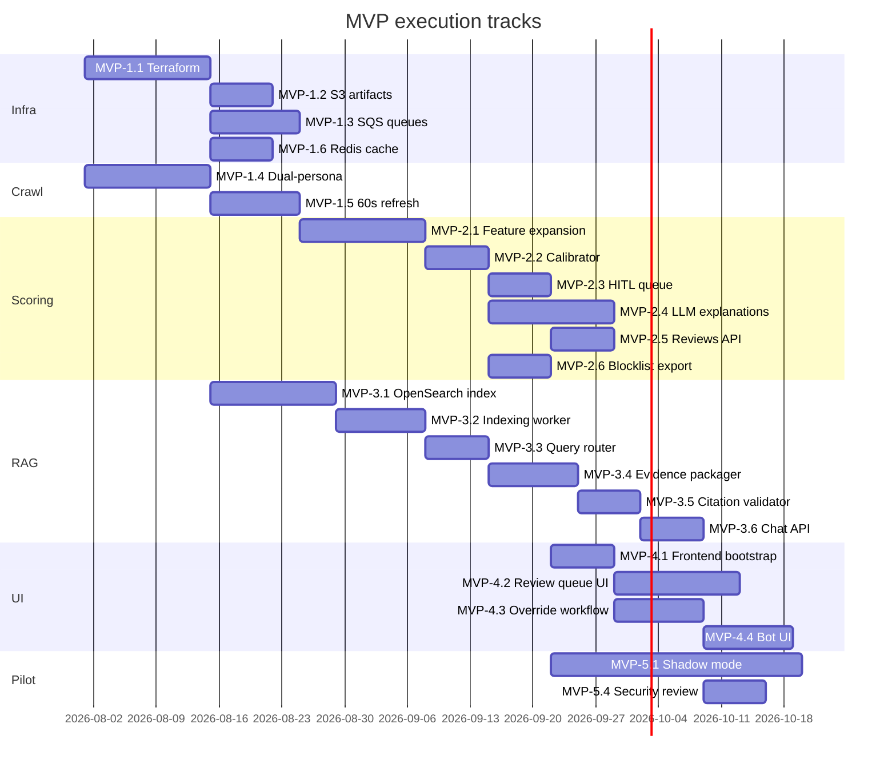

# MVP Execution Plan — Dual-Persona → RAG → Review Console → Pilot

**Created:** 2026-07-10  
**Duration:** 10–12 weeks after POC exit  
**Parent:** [`2026-07-05-phased-build-plan.md`](2026-07-05-phased-build-plan.md)  
**Gate in:** POC exit checklist complete  
**Gate out:** MVP exit checklist (shadow mode, RAG citation validator, review console E2E)

> **For agents:** Run MVP-1 tracks A/B/C in parallel. MVP-4 UI can start after MVP-2.3 (review queue API). MVP-3 RAG starts after MVP-1.1 (OpenSearch/Terraform).

---

## MVP phase map



---

## Sprint breakdown (6 sprints × 2 weeks)

### Sprint MVP-S1 — Infrastructure foundation

| Task ID | Agent | Deliverable |
|---------|-------|-------------|
| MVP-1.1 | `mfa-infra-engineer` | `infra/terraform/` — RDS, S3, SQS, ECS task defs; LocalStack dev parity doc |
| MVP-1.2 | `mfa-infra-engineer` + `mfa-backend-engineer` | S3 evidence store; signed URL proxy in API |
| MVP-1.3 | `mfa-infra-engineer` + `mfa-backend-engineer` | SQS batch + priority queues; migrate from Postgres poll |
| MVP-1.4 | `mfa-crawler-engineer` | Dual-persona: `direct` + Taboola/Outbrain referrer |
| MVP-1.6 | `mfa-backend-engineer` | Redis domain tier cache (24h TTL) |

**Exit:** Terraform applies in `poc` env; dual-persona smoke test passes.

**Branches:** `cursor/mvp-1-infra`, `cursor/mvp-1-crawl`, `cursor/mvp-1-redis`

---

### Sprint MVP-S2 — Crawl upgrade + feature expansion

| Task ID | Agent | Deliverable |
|---------|-------|-------------|
| MVP-1.5 | `mfa-crawler-engineer` | 60s dwell; `refresh_events_60s`, `avg_refresh_interval_sec` |
| MVP-2.1 | `mfa-ml-engineer` + `mfa-crawler-engineer` | Schema `v2`; ~40–60 features per `docs/SIGNALS.md` |
| MVP-2.2 | `mfa-ml-engineer` | Productionized calibrator; confidence bands validated |

**Exit:** `referral_direct_delta_score` on snapshots; schema migration doc.

---

### Sprint MVP-S3 — Scoring + HITL + LLM explanations

| Task ID | Agent | Deliverable |
|---------|-------|-------------|
| MVP-2.3 | `mfa-backend-engineer` | Review queue table + `GET /api/v1/reviews/queue` |
| MVP-2.4 | `mfa-backend-engineer` | Bedrock LLM explanations (signals-only context, ADR-001) |
| MVP-2.5 | `mfa-backend-engineer` | `POST /api/v1/reviews` — override with reason enum |
| MVP-2.6 | `mfa-backend-engineer` | `GET /api/v1/blocklist` — tier/confidence filter |

**Security gate:** `mfa-security-reviewer` on MVP-2.4 before merge.

**Exit:** Override preserves ML score; audit event on every review.

---

### Sprint MVP-S4 — RAG v1

| Task ID | Agent | Deliverable |
|---------|-------|-------------|
| MVP-3.1 | `mfa-infra-engineer` + `mfa-rag-engineer` | OpenSearch Serverless; hybrid BM25 + k-NN |
| MVP-3.2 | `mfa-rag-engineer` | Indexing worker by `doc_type` per `docs/RAG.md` |
| MVP-3.3 | `mfa-rag-engineer` | Query router — SQL vs vector by intent |
| MVP-3.4 | `mfa-rag-engineer` | Evidence packager + Bedrock generation |
| MVP-3.5 | `mfa-rag-engineer` | Citation validator |
| MVP-3.6 | `mfa-rag-engineer` + `mfa-backend-engineer` | `POST /api/v1/chat` + input sanitizer |
| MVP-3.7 | `mfa-rag-engineer` | RAG cache keyed by `evidence_hash` |

**Security gate:** `mfa-security-reviewer` required on MVP-3.6.

**Exit:** Test query set passes citation validator; audit per chat query.

---

### Sprint MVP-S5 — Review console + auth

| Task ID | Agent | Deliverable |
|---------|-------|-------------|
| MVP-4.1 | `mfa-review-ui-engineer` | `frontend/` — Vite + React + TS |
| MVP-4.2 | `mfa-review-ui-engineer` | Review queue UI — filters, signal viz |
| MVP-4.3 | `mfa-review-ui-engineer` | Override workflow UI |
| MVP-4.4 | `mfa-review-ui-engineer` | Bot chat UI with citations |
| MVP-4.5 | `mfa-infra-engineer` | Immutable audit export (DynamoDB or append-only Postgres) |
| MVP-4.6 | `mfa-infra-engineer` + `mfa-backend-engineer` | API Gateway + Cognito; RBAC stub |
| MVP-4.7 | Ops / `mfa-infra-engineer` | QuickSight or Grafana dashboard |

**Exit:** Reviewer can override end-to-end; bot renders citations.

---

### Sprint MVP-S6 — Pilot & shadow mode

| Task ID | Agent | Deliverable |
|---------|-------|-------------|
| MVP-5.1 | `mfa-platform-orchestrator` | Shadow mode runbook — score without block enforcement |
| MVP-5.2 | `mfa-backend-engineer` | DSP inventory CSV/S3 batch ingestion |
| MVP-5.3 | Human (Ad Ops) | Pilot sign-off with 1–2 advertisers |
| MVP-5.4 | `mfa-security-reviewer` | Full security review — RAG, auth, audit |

**Exit:** MVP exit checklist complete → unlock Production planning.

---

## Parallel agent matrix (MVP-S1 example)

| Time | Agent A (infra) | Agent B (crawler) | Agent C (backend) |
|------|-----------------|-------------------|-------------------|
| Wk 1 | MVP-1.1 Terraform modules | MVP-1.4 persona config | Redis compose service |
| Wk 2 | MVP-1.2 S3 + IAM | MVP-1.4 delta score | MVP-1.6 cache layer |
| Wk 3 | MVP-1.3 SQS consumers | MVP-1.5 refresh dwell | Wire queue migration |

**Conflict avoidance:** Infra touches `infra/` + compose; crawler touches `crawler/`; backend touches `backend/`. Merge order: infra → backend → crawler.

---

## MVP exit checklist

- [ ] Dual-persona + refresh signals in production crawl path
- [ ] LLM explanations with citations; no LLM in classifier path
- [ ] RAG v1 passes citation validator on test query set
- [ ] Reviewer console override + audit trail end-to-end
- [ ] Shadow mode completed; blocklist export approved
- [ ] MVP-5.4 security findings resolved

---

## New directories (MVP)

```
frontend/                 # MVP-4.1
backend/src/mfa/rag/      # MVP-3.x
infra/terraform/modules/  # MVP-1.1
```

Update `AGENTS.md` repository layout when `frontend/` is created.
