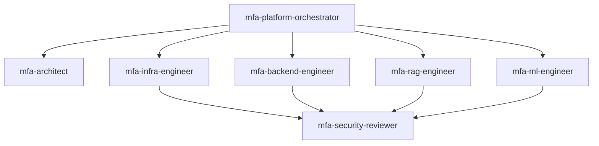

# Production Execution Plan — Scale, MLOps, Enterprise Hardening

**Created:** 2026-07-10  
**Duration:** 12–16 weeks after MVP exit  
**Parent:** [`2026-07-05-phased-build-plan.md`](2026-07-05-phased-build-plan.md)  
**Gate in:** MVP exit checklist complete  
**Gate out:** PROD-5.4 global rollout go/no-go

> **For agents:** Production work requires explicit user approval per `AGENTS.md`. Default agent scope is Baseline/MVP unless requested.

---

## Production phase map

| Track | Weeks | Agent lead | Task IDs |
|-------|-------|------------|----------|
| **Scale & NRT** | 1–6 | `mfa-infra-engineer` | PROD-1.1 → PROD-1.5 |
| **MLOps** | 4–10 | `mfa-ml-engineer` | PROD-2.1 → PROD-2.4 |
| **RAG v2** | 6–12 | `mfa-rag-engineer` | PROD-3.1 → PROD-3.4 |
| **Security & enterprise** | 1–14 | `mfa-infra-engineer` + `mfa-security-reviewer` | PROD-4.1 → PROD-4.5 |
| **Launch** | 12–16 | `mfa-platform-orchestrator` | PROD-5.1 → PROD-5.4 |

---

## Sprint PROD-S1 — Near-real-time path (weeks 1–3)

| Task ID | Agent | Deliverable | SLA |
|---------|-------|-------------|-----|
| PROD-1.1 | `mfa-infra-engineer` | Priority SQS FIFO queue | P95 ingest→classify <5 min |
| PROD-1.2 | `mfa-backend-engineer` | Pre-bid API — domain cache lookup | <200ms P95 |
| PROD-1.3 | `mfa-infra-engineer` | ECS auto-scaling on queue depth | Scale 5→30 workers |
| PROD-1.5 | `mfa-infra-engineer` | Multi-AZ RDS + read replica | Failover tested |

**Architect review:** ADR update if Feast/DynamoDB online store adopted (PROD-2.4).

---

## Sprint PROD-S2 — Batch at scale (weeks 3–5)

| Task ID | Agent | Deliverable |
|---------|-------|-------------|
| PROD-1.4 | `mfa-infra-engineer` | Step Functions nightly batch — millions of URLs |
| PROD-5.2 | `mfa-backend-engineer` | Slack alerts — high-spend MFA hits |

**Exit:** Batch + NRT coexist per architecture plan §8.

---

## Sprint PROD-S3 — MLOps (weeks 4–8)

| Task ID | Agent | Deliverable |
|---------|-------|-------------|
| PROD-2.1 | `mfa-ml-engineer` | Monthly auto-retrain — gold labels + reviewer overrides |
| PROD-2.2 | `mfa-ml-engineer` | Drift monitoring — PSI thresholds → CloudWatch |
| PROD-2.3 | `mfa-ml-engineer` | Shadow mode for model updates — 2-week minimum |
| PROD-2.4 | `mfa-infra-engineer` | Online feature store (if sub-100ms required) |

**Exit:** Model registry; retrain pipeline scheduled; drift alarms live.

---

## Sprint PROD-S4 — RAG v2 (weeks 6–10)

| Task ID | Agent | Deliverable |
|---------|-------|-------------|
| PROD-3.1 | `mfa-rag-engineer` | Similar-domain k-NN — tier-filtered results |
| PROD-3.2 | `mfa-rag-engineer` | Signal snapshot diff tool in query router |
| PROD-3.3 | `mfa-rag-engineer` | Reviewer feedback corpus indexed |
| PROD-3.4 | `mfa-rag-engineer` | RAG eval suite — groundedness + citation accuracy in CI |

**Security gate:** `mfa-security-reviewer` on PROD-3.4 CI gate.

---

## Sprint PROD-S5 — Enterprise security (weeks 1–12, parallel)

| Task ID | Agent | Deliverable |
|---------|-------|-------------|
| PROD-4.1 | `mfa-infra-engineer` | SSO (Okta) + full RBAC — admin, reviewer, ad_ops, auditor |
| PROD-4.2 | `mfa-infra-engineer` | WAF + Shield; API rate limiting |
| PROD-4.3 | `mfa-infra-engineer` | Multi-region DR — OpenSearch + RDS cross-region |
| PROD-4.4 | Ops | Cost attribution per team/campaign |
| PROD-4.5 | `mfa-security-reviewer` | SOC2-aligned controls documentation |

**Exit:** Pen test findings addressed; DR runbook exercised.

---

## Sprint PROD-S6 — Launch (weeks 12–16)

| Task ID | Owner | Deliverable |
|---------|-------|-------------|
| PROD-5.1 | `mfa-backend-engineer` | Blocklist enforcement in DSP integration |
| PROD-5.2 | Ops | Slack alert SLA documented |
| PROD-5.3 | `mfa-infra-engineer` | Runbook + on-call playbooks; SLOs monitored |
| PROD-5.4 | Product + `mfa-platform-orchestrator` | Global rollout go/no-go checklist |

---

## Production agent coordination

**Merge policy:** All Production PRs require `mfa-security-reviewer` pass for API, auth, AI, and audit changes.

---

## Production exit checklist

- [ ] P95 ingest→classification <5 min on priority queue
- [ ] Pre-bid API <200ms on cache hit
- [ ] Monthly auto-retrain pipeline operational
- [ ] RAG v2 eval suite in CI
- [ ] SSO + full RBAC enforced
- [ ] Multi-region DR tested
- [ ] Blocklist enforcement live with pilot sign-off
- [ ] SLOs defined and monitored

---

## Cost & scale milestones

| Tier | URLs/month | Key adjustment |
|------|------------|----------------|
| Pilot | 50K–500K | Single-region; 5–10 crawlers |
| Growth | 500K–5M | Auto-scaling fleet; tiered crawl depth |
| Enterprise | 5M–50M+ | Multi-region; domain dedup; hot/warm/cold queues |

See architecture plan §8 for AWS cost ranges.
